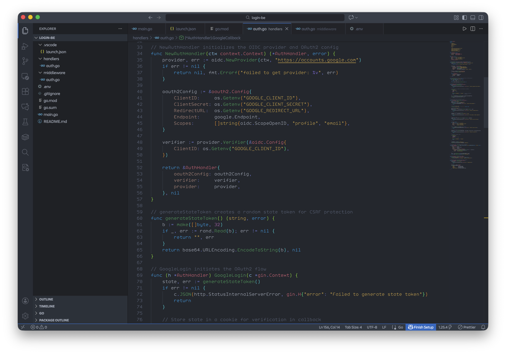

## Example Configuration Preview




### Manual file backup

All your config lives in one folder:

| OS | Path |
|---|---|
| **macOS** | `~/Library/Application Support/Code/User/` |
| **Windows** | `%APPDATA%\Code\User\` |
| **Linux** | `~/.config/Code/User/` |

The key files to back up:
- `settings.json` — all your settings
- `keybindings.json` — custom shortcuts
- `snippets/` — custom code snippets

For extensions, export the list:
```bash
code --list-extensions > extensions.txt
```

Then restore on the new machine:
```bash
cat extensions.txt | xargs -L 1 code --install-extension
```

To restore settings, just copy the files back to the same path on the new machine.

---

### Store config in a Git repo (power user)

Copy your `settings.json` and `keybindings.json` into a dotfiles repo, then symlink them back:

```bash
# Example on macOS/Linux
CWD=$(pwd)
rm ~/Library/Application\ Support/Code/User/keybindings.json
rm ~/Library/Application\ Support/Code/User/settings.json
ln -s $CWD/settings.json ~/Library/Application\ Support/Code/User/settings.json
ln -s $CWD/keybindings.json ~/Library/Application\ Support/Code/User/keybindings.json
```

This way your config is version-controlled and shareable.
